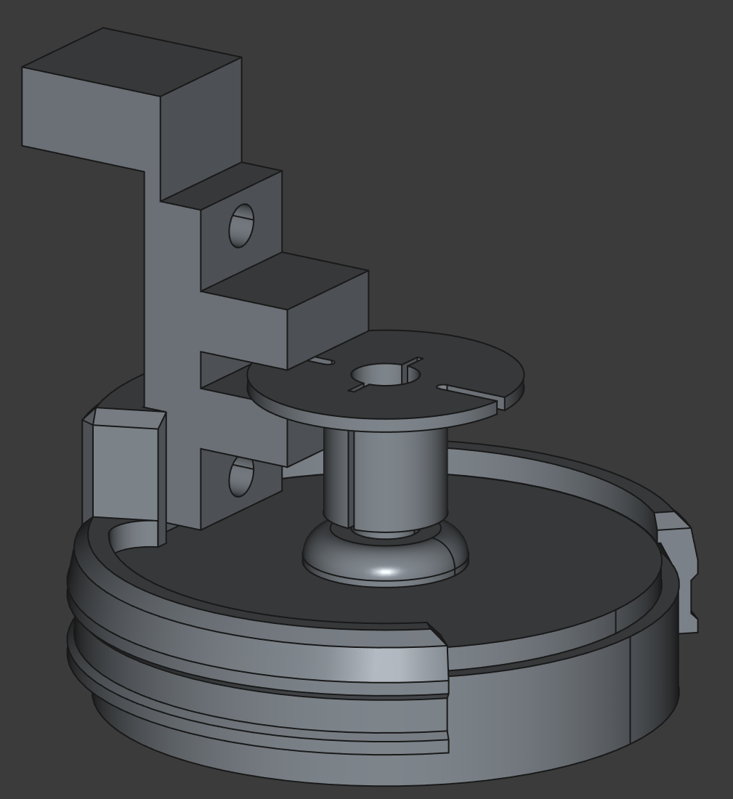

# Light-Barrier based RPM measurement device

3D-prints are designed to fit on top of a 775 motor which is common among 3018 CNC machines.

Parts needed:

* WeMos D1 mini
* WeMos D1 OLED shield 0.66" with 64x48 px
* Light barrier endstop

Software used:

* [FreeCAD](https://freecad.org/) for editing the 3D model
* [PlatformIO](http://platformio.org/) for building/flashing
* [Teleplot](https://marketplace.visualstudio.com/items?itemName=alexnesnes.teleplot) for live view

